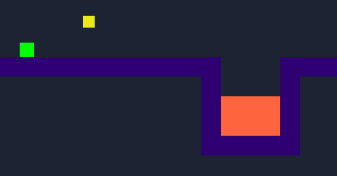

# NEON
## Hello! Welcome to `Neon`, a platformer!
### What is dis?
------------------
A cool platformer, it's very easy to change and add levels if you fork it because it's just an array of strings, and after you play you will understand which character is what.
 
or, you can look at this chart:
 
| Character | Type | Compatibility|
| --------- | ---- |--------------|
|      `o`    | Coin |  Working  | 
|     `x`    | Wall |  Working  |
|     `!`    | Lava |  Working  |
|`-`, `=`, `\|`, `v`, `^`|Moving Lava| Bugged / Do not use|
#### COLLECT ALL COINS TO WIN

### Credits
---------------------------
We used scrap code for a platformer. [Click here](https://codepen.io/0030310/pen/xxOZZyd) to go to the codepen page
 *__NOTE:__ atleast i think thats the project, it may be another remix of the original*
